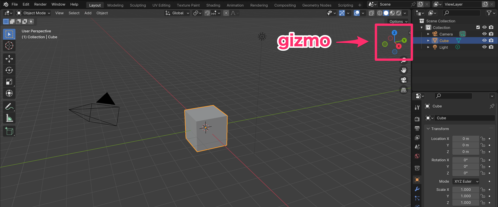
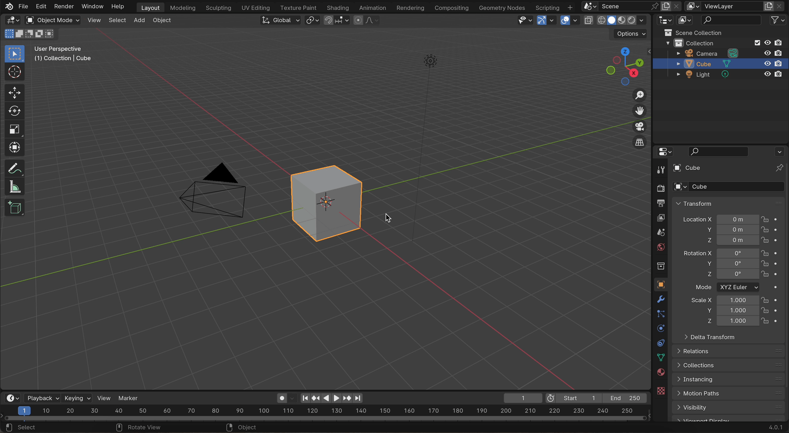
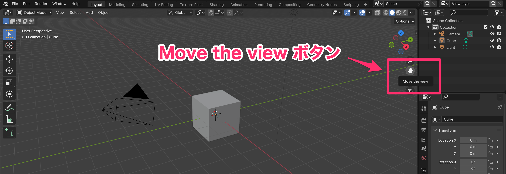
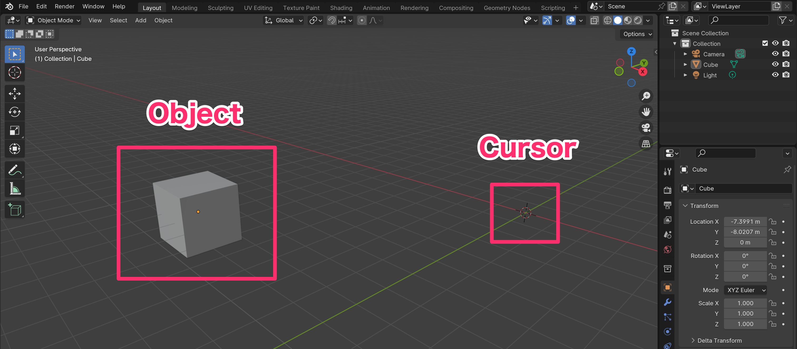
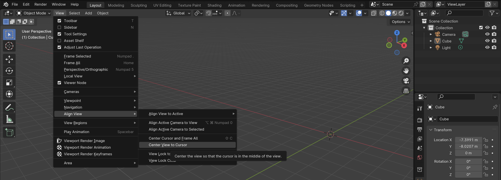
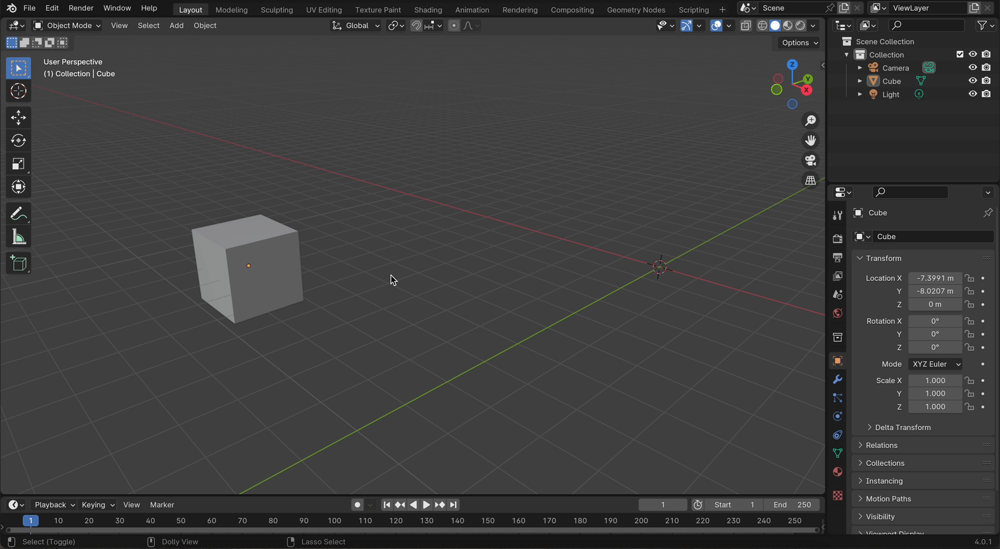
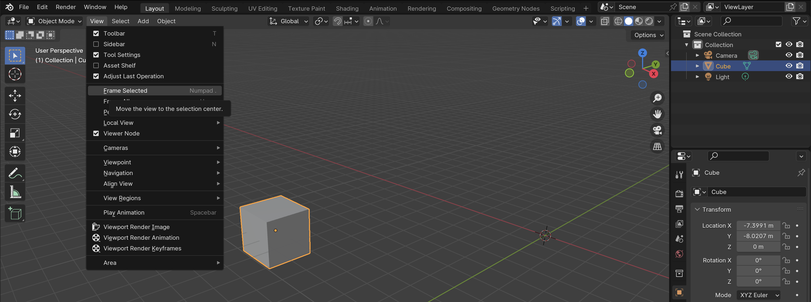
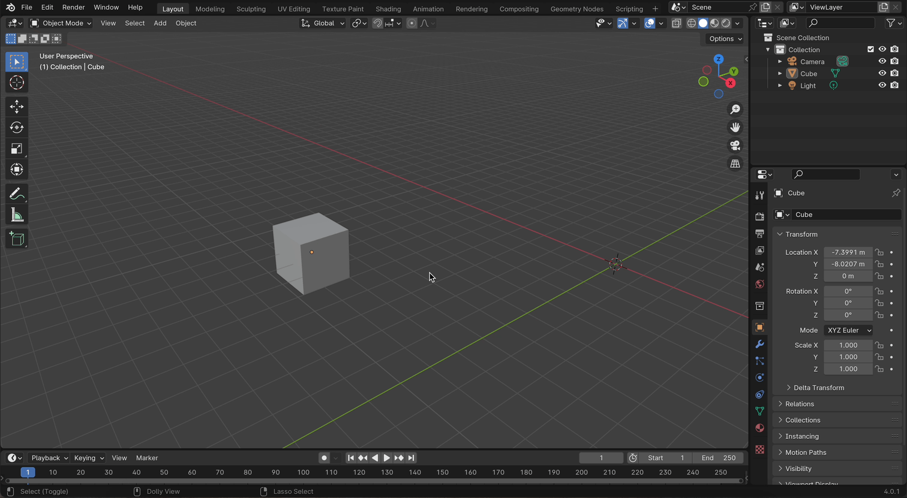
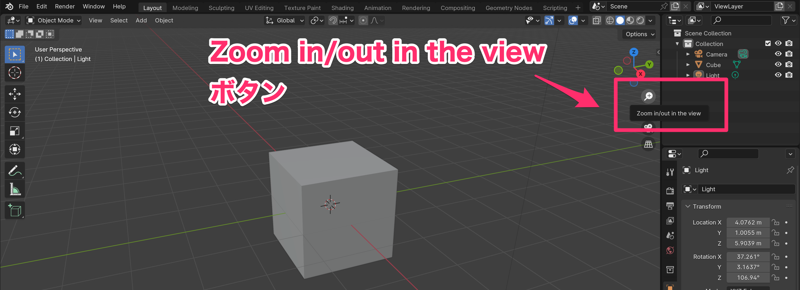
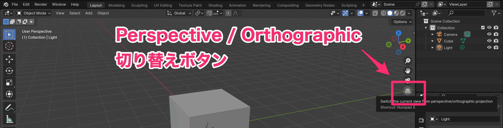

# Viewport の操作

## 回転

### ショートカット

- 3ボタンマウスの場合
  - 真ん中のボタンをクリックしたままドラッグ
- トラックパッドの場合
  - 2本指でスクロール

### 画面上で操作

- Gizmo をドラッグ

- Gizmo の x, y, z, -z, -y, -z をクリック

## 移動

### ショートカット

- 3ボタンマウスの場合
  - Shift + 真ん中のボタンをクリックしたままドラッグ
- トラックパッドの場合
  - Shift + 2本指でスクロール

### 画面上で操作

- 画面上の "Move the view" ボタンを押しながらドラッグ 

### View の中心を Cursor に合わせる

- [View] - [Align View] - [Center View to Cursor]

### View の中心を Object に合わせる

- Object を選択した状態で [View] - [Frame Selected]

## 拡大縮小

### ショートカット

- 3ボタンマウスの場合
  - マウスホイールを回転
- トラックパッドの場合
  - Ctrl + 2本指でスクロール

### 画面上で操作

- 画面上の "Zoom in/out in the view" ボタンを押しながらドラッグ

## Perspective(透視投影) / Orthographic(平行投影) 切り替え

- 画面上の "Switch the current view from perspective/orthographic projection" ボタンをクリック

