# Object 操作

## Quick Tools Menu

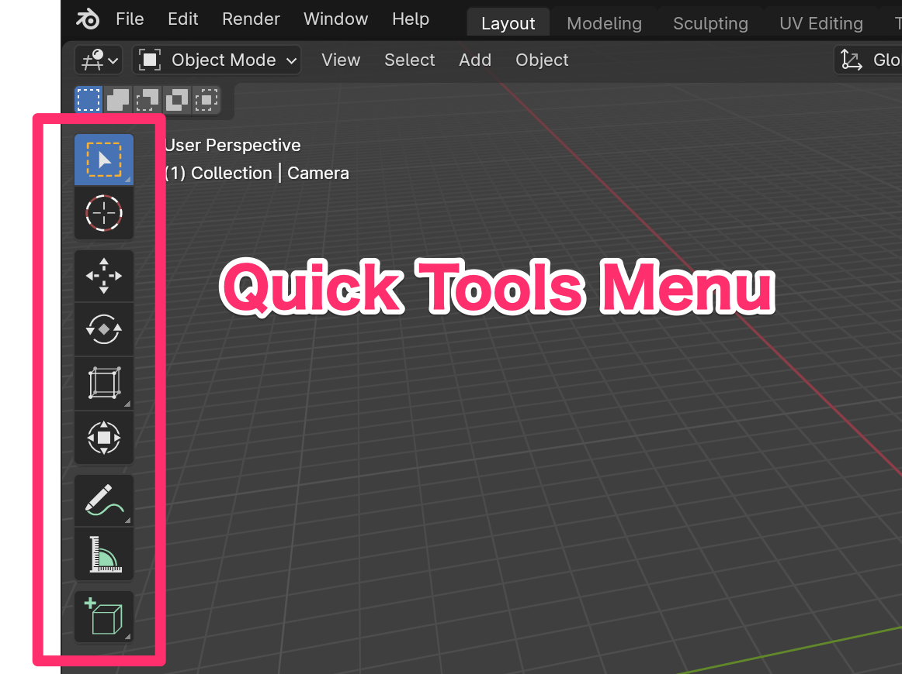

### ショートカット

表示/非表示切り替え

- t

### 画面上で操作

表示

- 左端の > をクリック

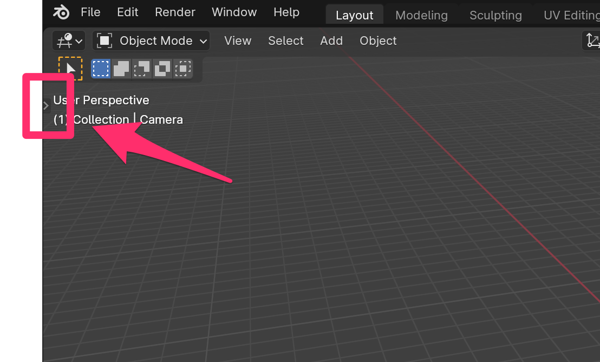

### 手元に表示

- Shift + Space

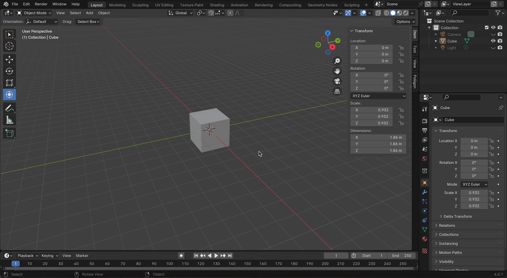

## Additional Quick Settings

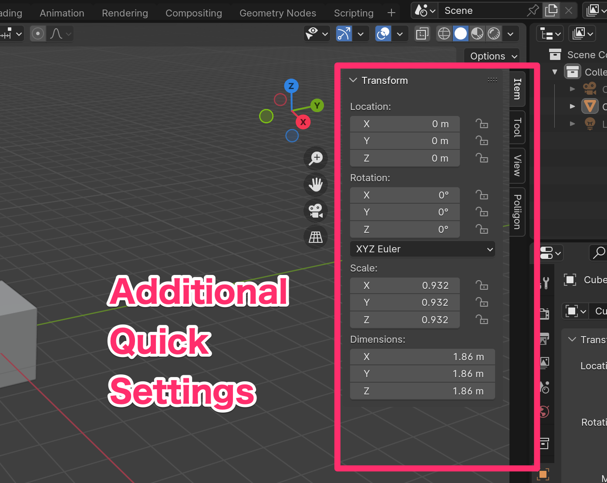

### ショートカット

表示/非表示切り替え

- n

### 画面上で操作

表示

- 右端の < をクリック

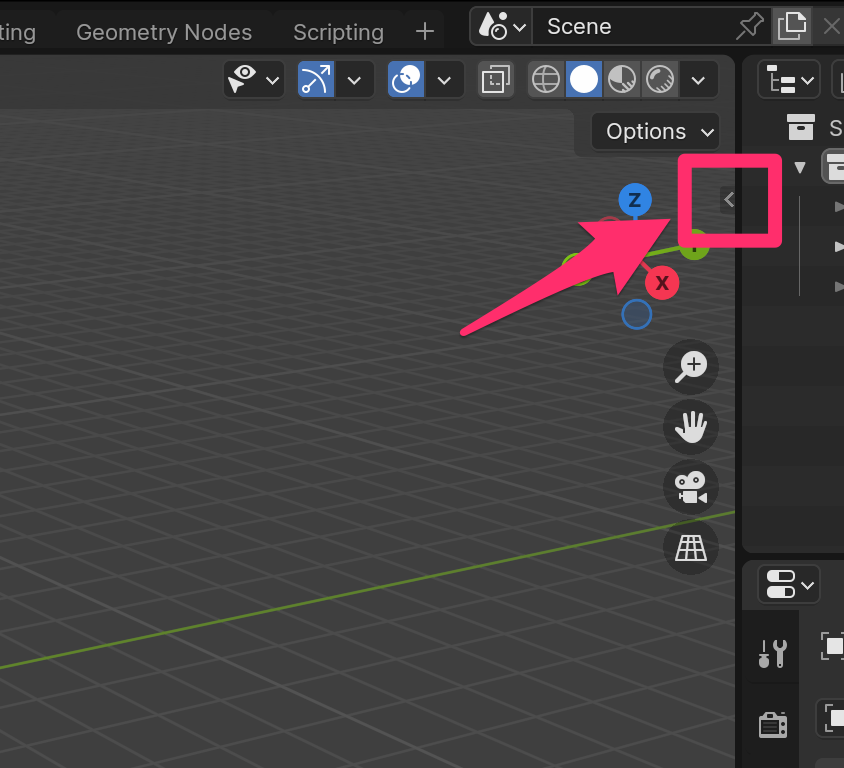

## Undo

### ショートカット

- Ctrl (Command) + z

### 画面上で操作

- [Edit] - [Undo]

## Mesh Object 追加

[3D Cursor](cursor.md) の位置に出現します

### ショートカット

- Shift + a
  - [Mesh] - [Cube]とか

### 画面上で操作

- [Add] - [Mesh] - [Cube]とか

## 削除

### ショートカット

- x 
  - d

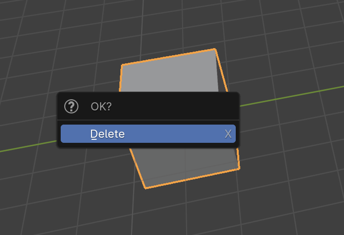

### 画面上で操作

- [Object] - [Delete]

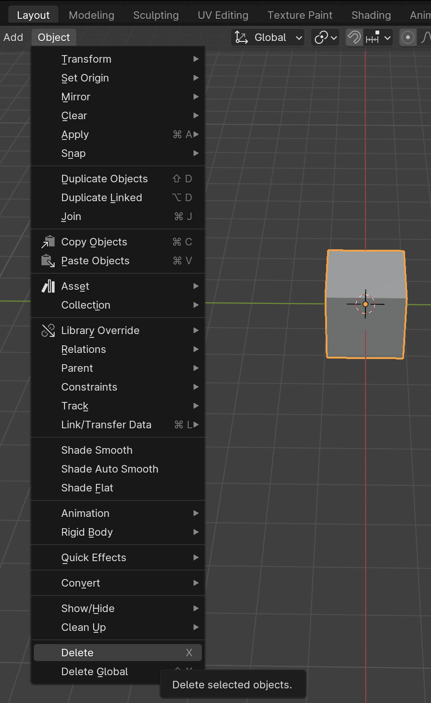

## 選択

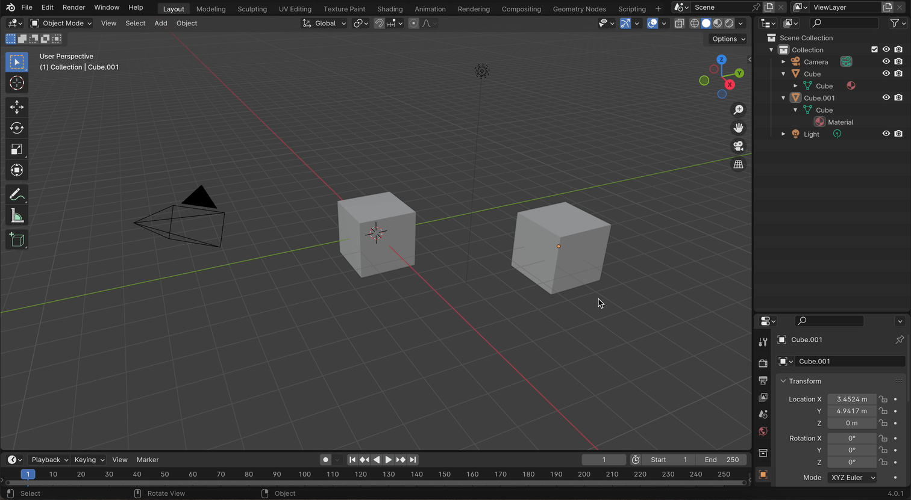

### 単一選択
 
- 左クリック

（＊右クリックで Object 選択する設定にすることも可能）

### 選択解除

- 空の領域を左クリック

### 全選択

#### ショートカット

- a

#### 画面上で操作

- [Select] - [All]

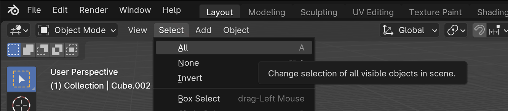

### 選択全解除

#### ショートカット

- Alt (option) + a

#### 画面上で操作

- [Select] - [None]

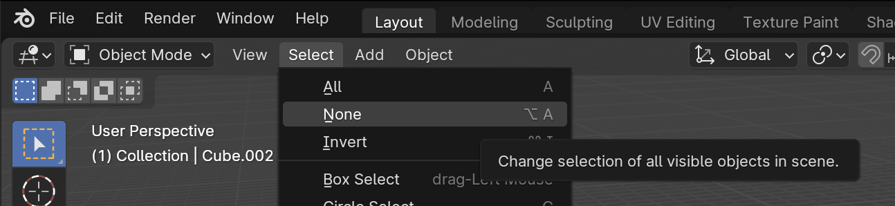

### 複数選択

- Shift + 左クリック

選択を解除するときも同じ操作

最後に選択されたオブジェクトが Active Object になる。Active Object は他より少し明るい選択色になっている。

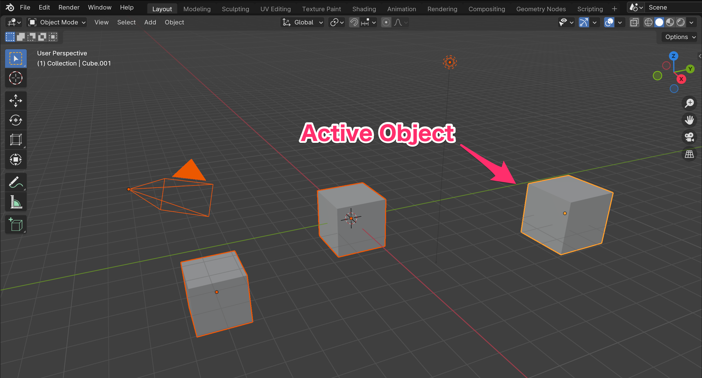

### 範囲選択

Select Box の状態で

- 左クリックしたままドラッグ

### 選択解除範囲選択

Select Box の状態で

- Ctrl + 左クリックしたままドラッグ

## 移動

移動するとき

- Ctrl を押していると、グリッドに snap しながら移動する
- Shift を押していると、細かく移動する

### ショートカット

- オブジェクトを選択
  - g : 移動 
    - x : X軸に沿って移動 
    - y : Y軸に沿って移動 
    - z : Z軸に沿って移動 
    - shift + x : YZ平面に沿って移動 
    - shift + y : XZ平面に沿って移動 
    - shift + z : XY平面に沿って移動 
    - x x : Local X軸に沿って移動
    - y y : Local Y軸に沿って移動
    - z z : Local Z軸に沿って移動
    - shift + x x : Local YZ平面に沿って移動
    - shift + y y : Local XZ平面に沿って移動
    - shift + z z : Local XY平面に沿って移動
    - esc : キャンセル

### 画面上で操作

- オブジェクトを選択
  - Move tool をクリック
    - 真ん中の白い円をドラッグ : 自由移動
    - X軸の矢印をドラッグ : X軸に沿って移動
    - Y軸の矢印をドラッグ : Y軸に沿って移動
    - Z軸の矢印をドラッグ : Z軸に沿って移動
    - 赤の四角をドラッグ : YZ軸方向に沿って移動
    - 緑の四角をドラッグ : XZ軸方向に沿って移動
    - 青の四角をドラッグ : XY軸方向に沿って移動
    - Transform Orientation を Local にすると、Local の座標軸に沿って移動
    - ドラッグ中に esc : キャンセル

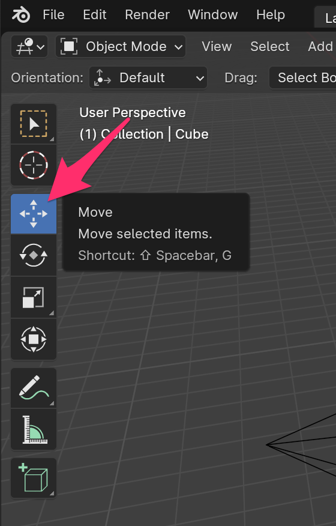

### リセット

- Alt (Option) + g
- [Object] - [Clear] - [Location]

## 回転

回転するとき

- Ctrl を押していると、5°ずつ回転する
- Shift を押していると、細かく回転する

### ショートカット

- オブジェクトを選択
  - r : 回転
    - x : X軸まわりに回転
    - y : Y軸まわりに回転
    - z : Z軸まわりに回転
    - x x : Local X軸まわりに回転
    - y y : Local Y軸まわりに回転
    - z z : Local Z軸まわりに回転
    - esc : キャンセル

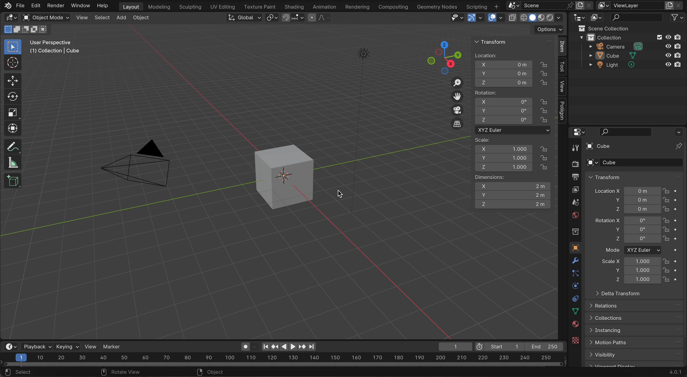

### 画面上で操作

- オブジェクトを選択
  - Rotate tool をクリック
    - 外周の白い円をドラッグ : 見えている向きを軸として回転
    - 内側の色付き曲線の間をドラッグ : 自由回転
    - 赤の曲線をドラッグ : X軸まわりに回転
    - 緑の曲線をドラッグ : Y軸まわりに回転
    - 青の曲線をドラッグ : Z軸まわりに回転
    - Transform Orientation を Local にすると、Local の座標軸に沿って移動
    - ドラッグ中に esc : キャンセル

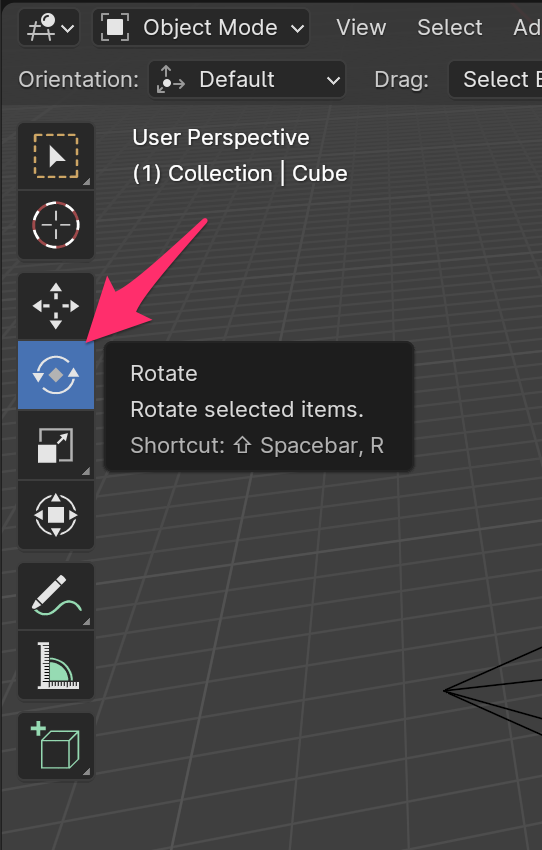

### リセット

- Alt (Option) + r
- [Object] - [Clear] - [Rotation]

## 拡大縮小

- Ctrl を押していると、グリッドに snap しながら拡大縮小する
- Shift を押していると、細かく拡大縮小する

### ショートカット

- オブジェクトを選択
  - s : 拡大縮小 
    - x : X軸方向に拡大縮小
    - y : Y軸方向に拡大縮小 
    - z : Z軸方向に拡大縮小 
    - shift + x : YZ軸方向に拡大縮小 
    - shift + y : XZ軸方向に拡大縮小 
    - shift + z : XY軸方向に拡大縮小 
    - x x : Local X軸方向に拡大縮小
    - y y : Local Y軸方向に拡大縮小
    - z z : Local Z軸方向に拡大縮小
    - shift + x x : Local YZ軸方向に拡大縮小
    - shift + y y : Local XZ軸方向に拡大縮小
    - shift + z z : Local XY軸方向に拡大縮小 
    - esc : キャンセル

### 画面上で操作

- オブジェクトを選択
  - Scale tool をクリック
    - 外側をドラッグ : XYZ軸方向に拡大縮小
    - 赤の直線をドラッグ : X軸方向に拡大縮小
    - 緑の直線をドラッグ : Y軸方向に拡大縮小
    - 青の直線をドラッグ : Z軸方向に拡大縮小
    - 赤の四角をドラッグ : YZ軸方向に拡大縮小
    - 緑の四角をドラッグ : XZ軸方向に拡大縮小
    - 青の四角をドラッグ : XY軸方向に拡大縮小 
    - Transform Orientation を Local にすると、Local の座標軸に沿って移動
    - ドラッグ中に esc : キャンセル

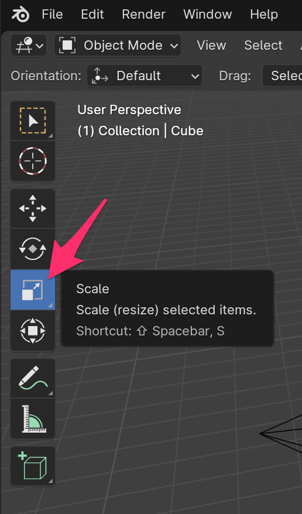

- オブジェクトを選択
  - Scale tool を長押しして Scale Cage にカーソルを移動してから離す
    - Cage 内のハンドル以外をドラッグ : XYZ軸方向に拡大縮小
    - Cage のハンドルをドラッグ : Cage のハンドル方向に拡大縮小
    - ドラッグ中に esc : キャンセル

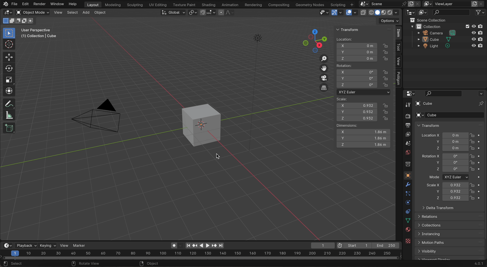

### リセット

- Alt (Option) + s
- [Object] - [Clear] - [Scale]

## 複製

### Duplicate Objects

メッシュも含めて複製する

- オブジェクトを選択
  - Shift + d
  - または
  - [Object] - [Duplicate Objects]

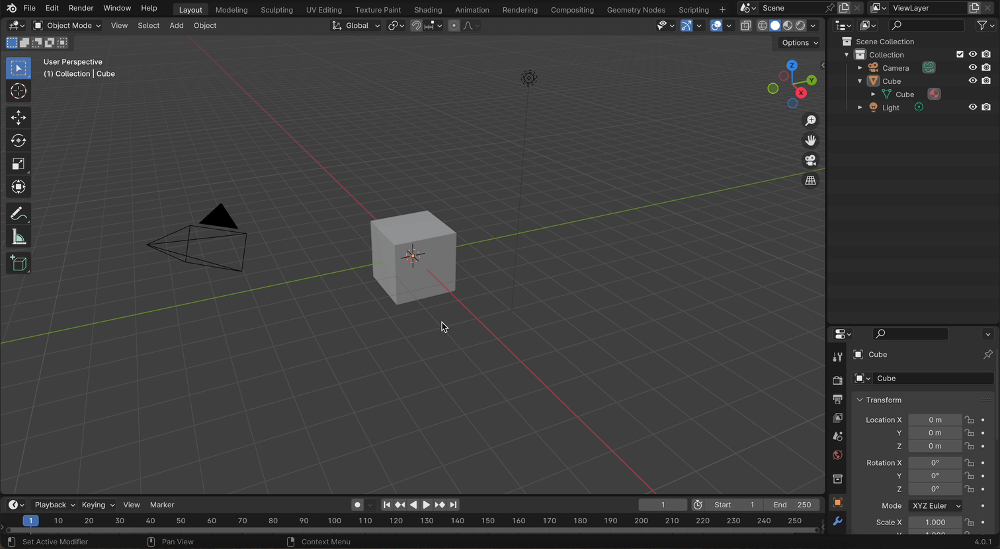

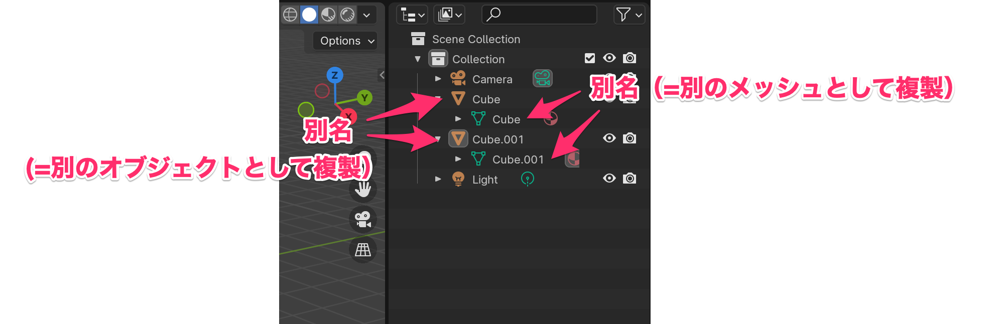

### Duplicate Linked

メッシュがリンクしたオブジェクトを複製する
 
- オブジェクトを選択
    - Alt(Option) + d
    - または
    - [Object] - [Duplicate Linked]

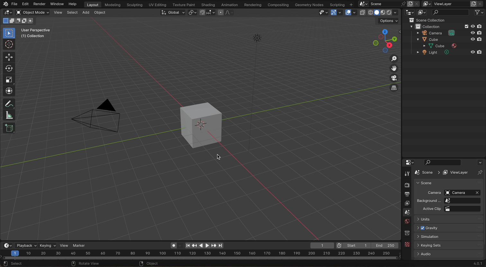

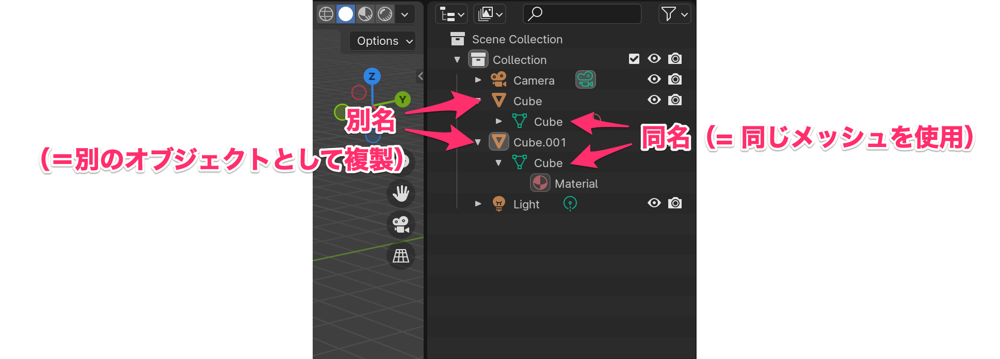

[メッシュとは](about_mesh.md)

## Parent

オブジェクトに親子関係をセットする

- 子にするオブジェクトを選択
- Shift を押しながら親にするオブジェクトを選択
  - [Object] - [Parent] - [Object]
  - 右クリック [Parent] - [Object]
  - Ctrl (Command) + p - [Object]

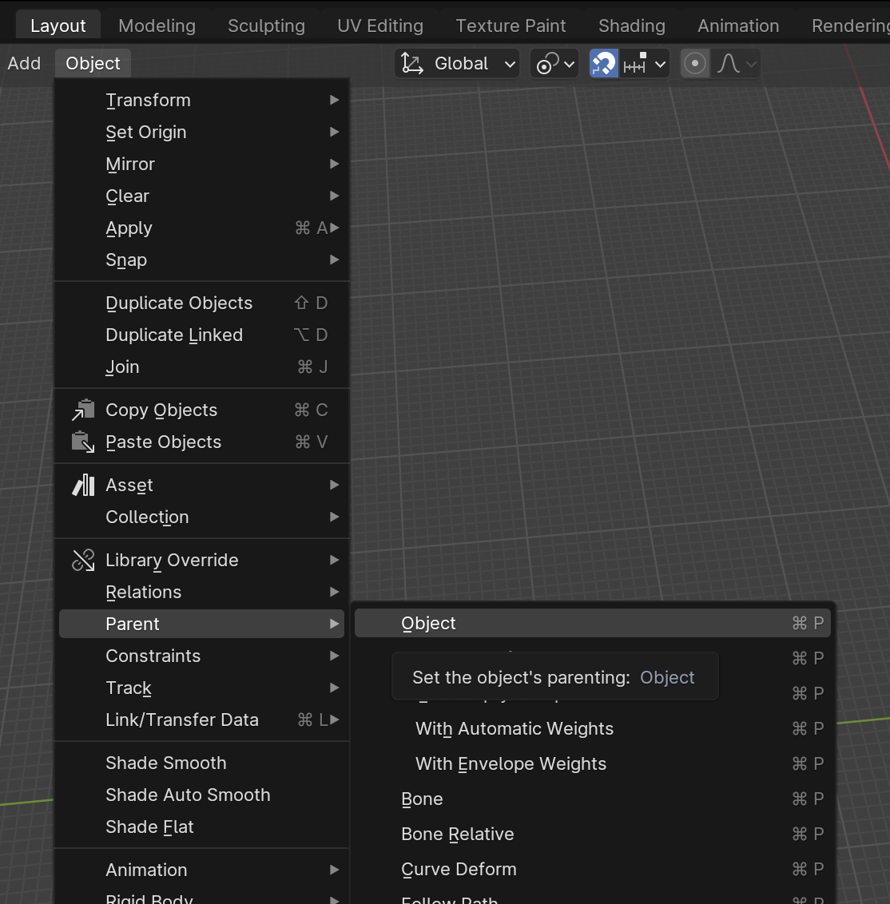

オブジェクトが親子関係になると、 親の Transform（移動、回転、拡大縮小）が子にも適用されます。

### 解除

#### 親の Transform を適用しないで解除

- 解除する子オブジェクトを選択
  - [Object] - [Parent] - [Clear Parent]
  - 右クリック [Parent] - [Clear Parent]
  - Alt (Option) + p - [Clear Parent]

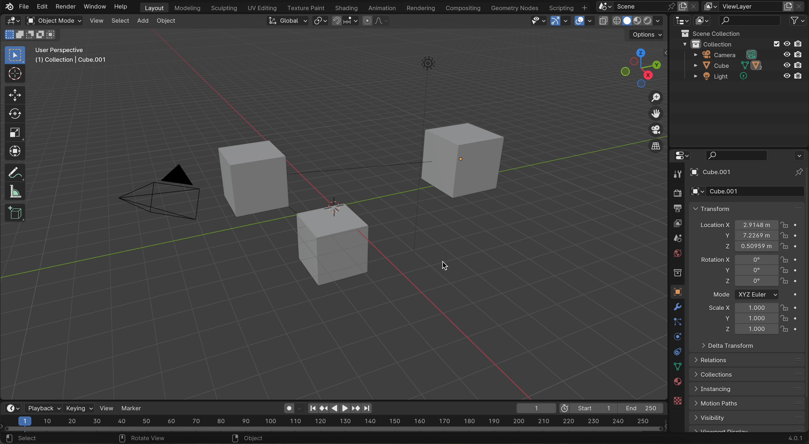

#### 親の Transform を適用して解除

- 解除する子オブジェクトを選択
  - [Object] - [Parent] - [Clear and Keep Transformation]
  - 右クリック [Parent] - [Clear and Keep Transformation]
  - Alt (Option) + p - [Clear and Keep Transformation]

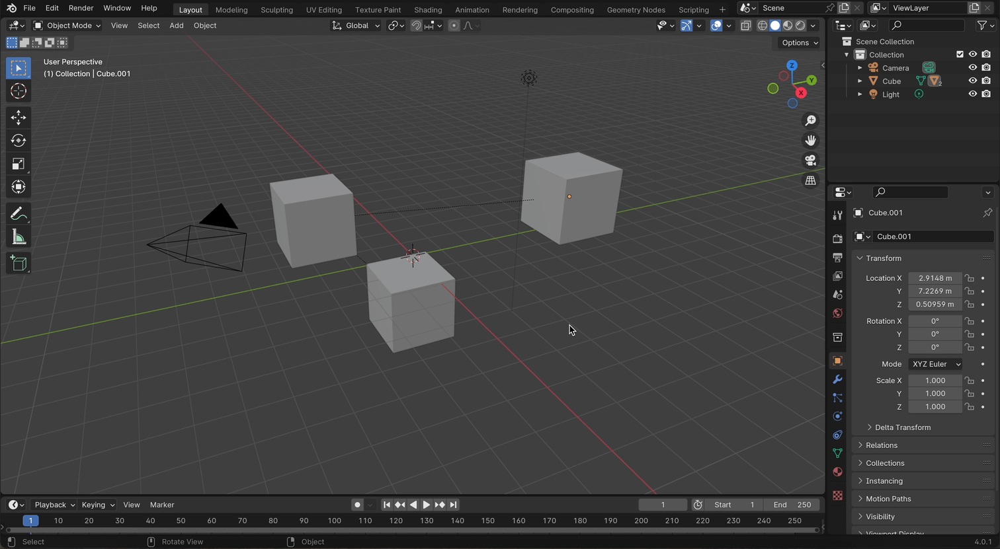

## Object の Origin を変える

Object の Origin とは、Location が 0,0,0 になる位置です

## Object の Origin を 3D Cursor の位置にする

- オブジェクトを選択
  - [Object] - [Set Origin] - [Origin to 3D Cursor]
  - 右クリック [Set Origin] - [Origin to 3D Cursor]

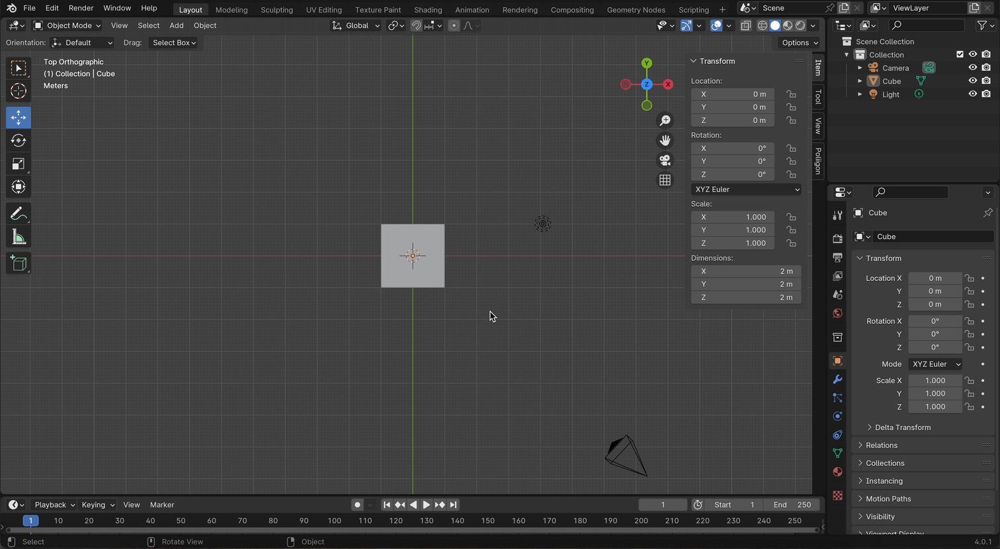
