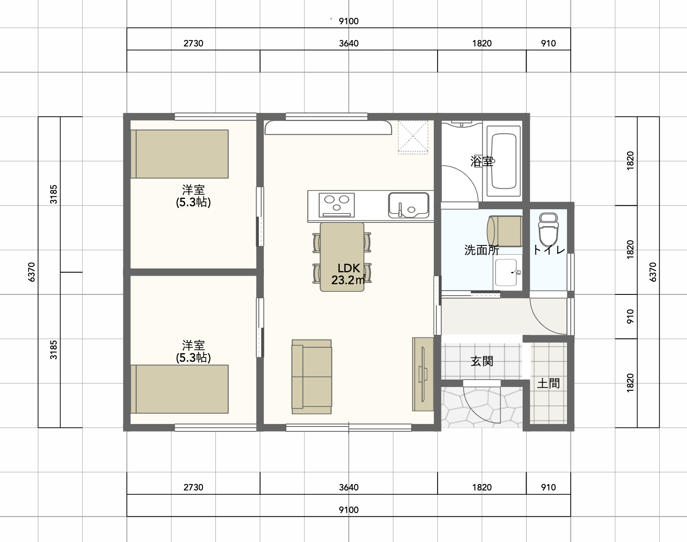

# Hands-on

## 基本操作

1. [インストール](1_setup.md)
2. [起動](2_first_step.md)
3. [Workspace](workspace.md)
4. [Viewport 操作](3_viewport_navigation.md)
5. [Object 操作](4_object_manipulation.md)

## Tips

- [Snap](snap.md)
- [メッシュとは](about_mesh.md)
- [3D Cursor](cursor.md)
- [Edit Mode](edit_mode.md)
- [Local View](local_view.md)

## 家を作る

今回作る家

1. [家を作るための設定](make_house_step1.md)
2. [柱を作る](make_house_step2.md)
3. [壁を作る](make_house_step3.md)
4. [床を作る](make_house_step4.md)
5. [窓を作る](make_house_step5.md)
6. [ドアを作る](make_house_step6.md)
7. [壁に色をつける](make_house_step7.md)
8. [床をフローリングにする](make_house_step8.md)

