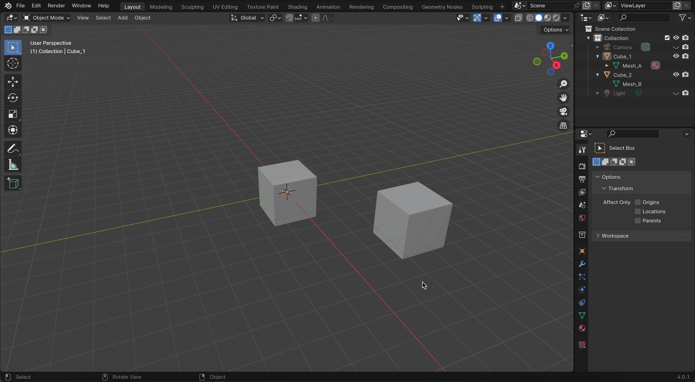

# メッシュとは

メッシュは「Vertex（頂点）、Edge（辺）、Face（面）」で構成されるデータで、要は形のデータです。

オブジェクトというのは、  
メッシュ + Transform（座標、回転、拡大縮小）  
なのです。

そのため、同じメッシュを使っているオブジェクトが複数ある場合、どちらかでメッシュを編集すると、
もう一方のオブジェクトの表示も変わります。

↑ Cube_1 のメッシュが Mesh_A、Cube_2 のメッシュが Mesh_B のときに 
Cube_2 のメッシュを変更しても Cube_1 の見た目は変わりませんが、
Cube_2 のメッシュを Mesh_A に変更した後 Cube_2 のメッシュを変更すると、
Mesh_A を使っている Cube_1 の見た目も変わります。

