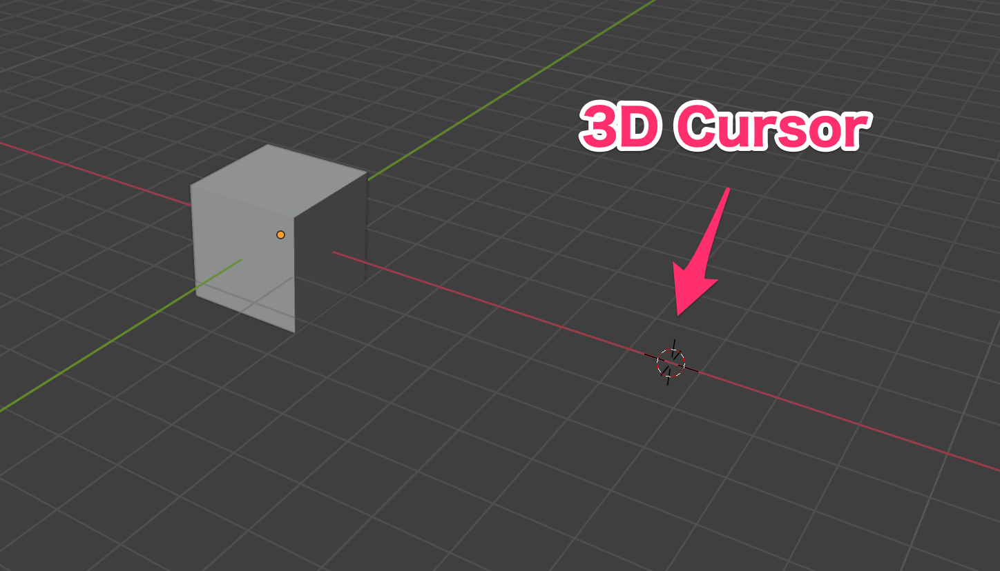
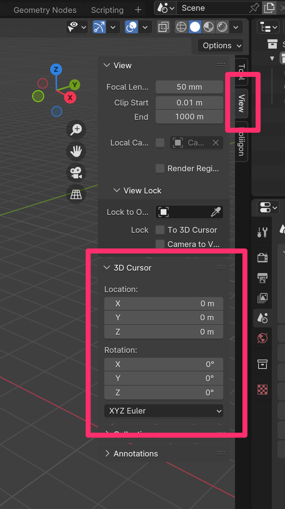
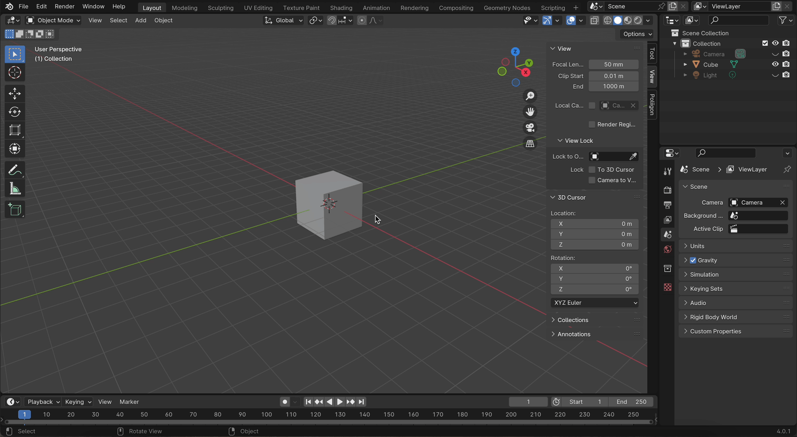
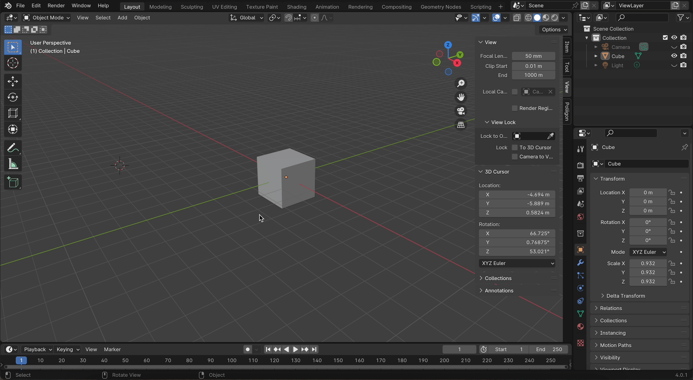
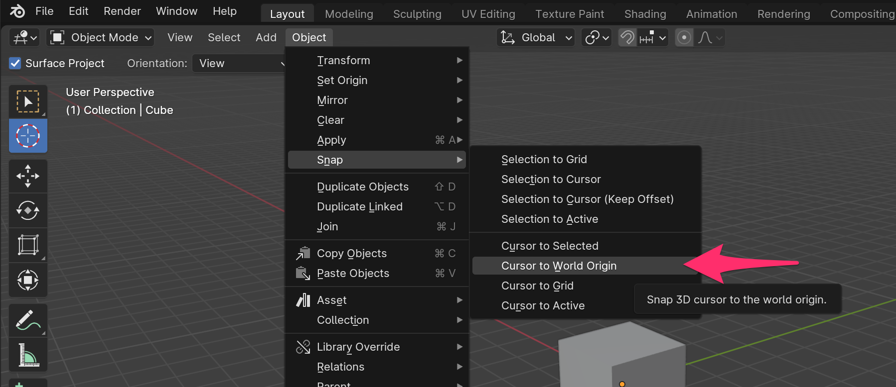

# 3D Cursor

## 3D Cursor の使い道

- 任意の座標に 3D Cursor を移動できる
- [Add] から Object を追加するとき、3D Cursor の位置に出現する
- 3D Cursor の位置に Object を snap できる

## 3D Cursor の座標

3D Cursor の現在位置は 

[Additional Quick Settings] - [View] - [3D Cursor]

で見ることができます。

## 3D Cursor の移動

### 3D Cursor Menu

3D Cursor Menu の Location や Rotation の値を変更することで、3D Cursor の位置や回転を変更することができます。

入力エリアでは以下の方法で値を変更できます。

- `>` ボタンをクリック : 値が増える
- `<` ボタンをクリック : 値が減る
- 直接入力
- 入力エリア上で左右にドラッグ

### Quick Tools Menu

- Quick Tools Menu の Cursor をクリックする
  - 左クリック

### ショートカット

- Shift + 右クリック

## 3D Cursor の World Origin への移動

### ショートカット

- Shift + s
  - Pie Menu の Cursor to World Origin をクリック

＊ Pie Menu をキャンセルする時は右クリック or esc

### 画面上で操作

- [Object] - [Snap] - [Cursor to World Origin]

