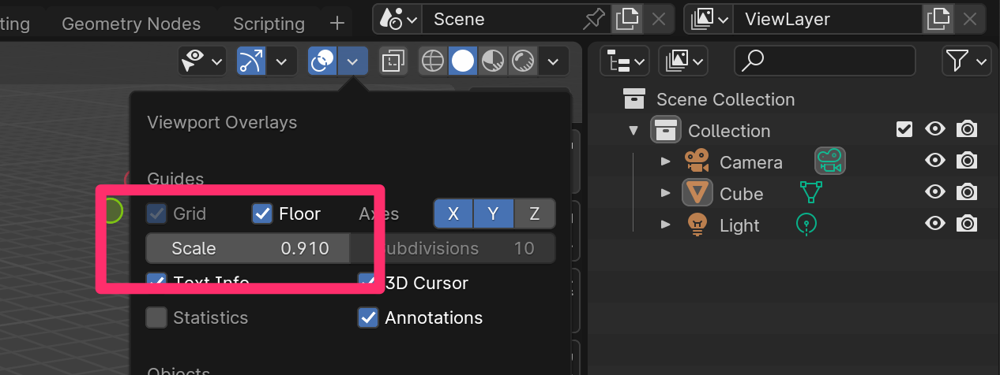
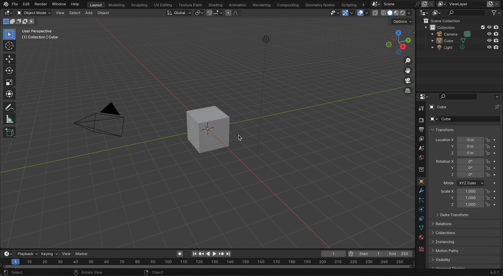
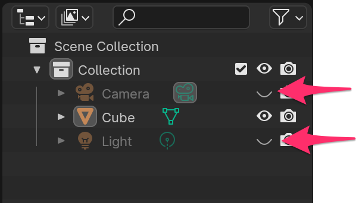
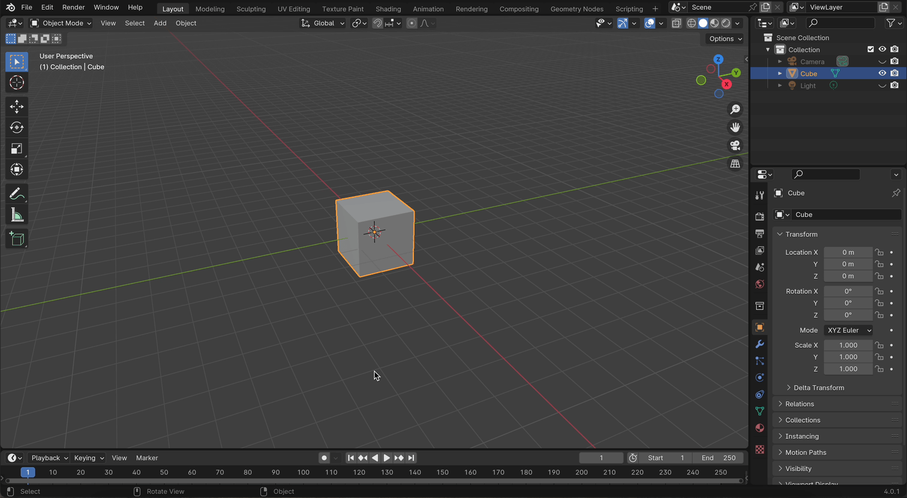
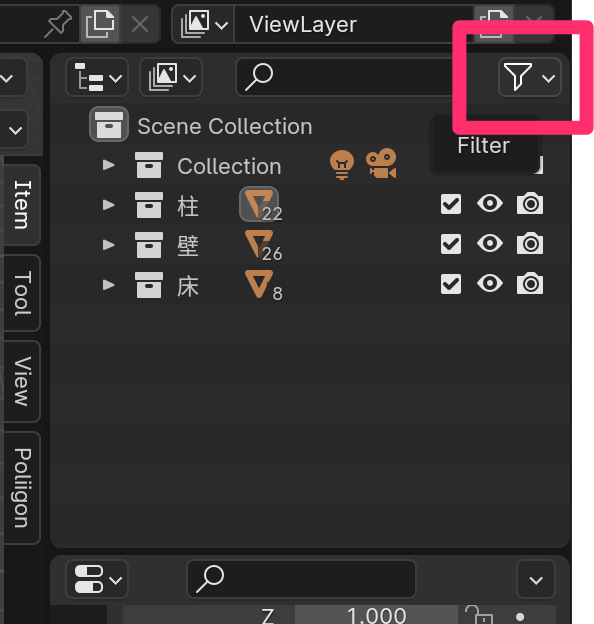
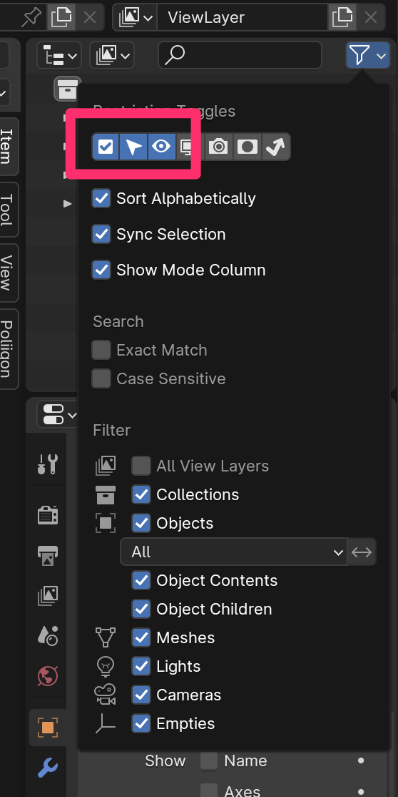
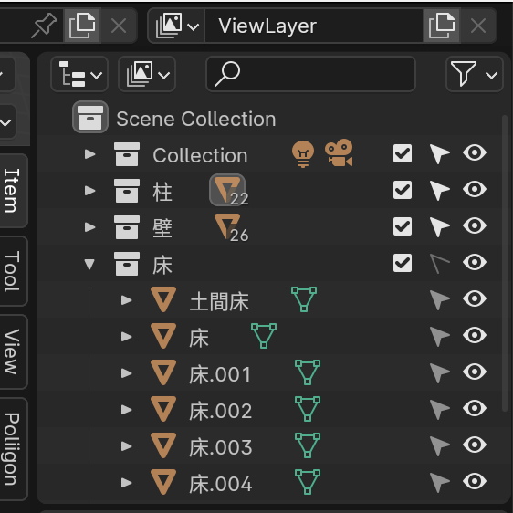

# 家を作るための設定

## Grid のサイズを 910mm にする

日本の家は畳の短辺の長さである 910mm のグリッドで設計することが多いです。

そこで Floor の Scale サイズを 910 mm 単位にします。

## Camera と Light を非表示にする

しばらく使わないので Camera と Light を非表示にしておきます。

非表示 (hide) にするには

- オブジェクトを選択
  - h

または、Outliner の目玉ボタンをクリックします。

- Alt (option) + h

で全ての hide が解除されます

## Timeline を消す

Layout workspace の下部に表示されている Timeline は使わないので消しておきます。

- 3D Viewport エリアと Timeline エリアの境界で右クリック
  - [Join Areas]
    - Timeline エリア側をクリック

## Selectable の ON / OFF

オブジェクトが増えてきたときに、意図しないオブジェクトを選択しないように「Selectable」の
ON / OFF を Outliner でできるようにします。

- Outliner の 右上の Filter をクリックします。

- Restriction Toggle の「チェックマーク(Exclude from View Layer)」、「矢印マーク(Selectable)」、「目玉マーク（Hide in Viewport)」だけ選択します。（ここではレンダリングは使わないのでカメラは外してOK）

矢印をクリックして OFF になった Collection や Object は選択ツールで選択されなくなります。

