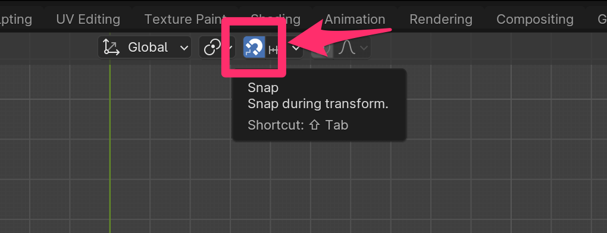

# 柱を作る

## 柱 Object を作る

### 柱 Collection を作る

1. Outliner の空いてるところで右クリック
   - [New Collection] をクリック
2. 追加された Collection 名の部分をダブルクリック
   - 「柱」にリネーム 
3. Outliner で Cube をドラッグして「柱」Collection に移動
4. Cube のオブジェクト名とメッシュ名を両方「柱」にする

### Cube を柱の形にする

1. Additional Quick Settings の View を開く（ショートカットは n）
2. 柱 Object を選択する
3. Dimension の X を 0.14 m にする
4. Dimension の Y を 0.14 m にする
5. Dimension の Z を 2.6 m にする
6. Location の Z を 1.1 m にする
7. [Object] - [Apply] - [All Transforms] をクリックして、変更した Transform をメッシュに適用する

＊ Apply のショートカット : Ctrl (Command) + a

## 柱 Object を配置する

### 柱を立てる場所

1. gizmo の z をクリックして上からみた表示にする
2. Alt (option) + d でメッシュがリンクした複製を作る
   - グリッドに合わせて配置する
     - Ctrl を押しながら移動
     - snap を on にしてから移動する

全ての柱を配置します。

