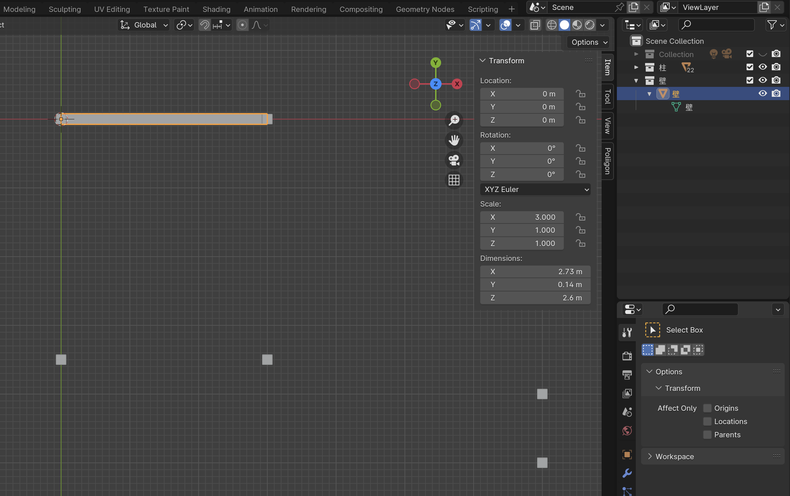

# 壁を作る

## 壁 Object を作る

### 壁 Collection を作る

1. Outliner の空いてるところで右クリック
    - [New Collection] をクリック
2. 追加された Collection 名の部分をダブルクリック
    - 「壁」にリネーム
3. 壁以外の Collection を非表示にしておく
4. 壁 Collection を選択している状態で
   - [Add] - [Mesh] - [Cube] をクリック

5. Cube の Object 名と Mesh 名を「壁」にする

### Cube を壁の形にする

1. Additional Quick Settings の View を開く（ショートカットは n）
2. 壁 Object を選択する
3. Dimension の X を 0.91 m にする
4. Dimension の Y を 0.14 m にする
5. Dimension の Z を 2.6 m にする
6. Location の X を 0.455 m にする
7. Location の Y を 0 m にする
8. Location の Z を 1.1 m にする

9. [Object] - [Apply] - [All Transforms] をクリックして、変更した Transform をメッシュに適用する

## 壁 Object を配置する

### 壁を立てる場所

1. gizmo の z をクリックして上からみた表示にする
2. 柱 Collection を表示する
3. 壁 Object を選択する
4. Alt (option) + d でメッシュがリンクした複製を作る
    - Scale の X を壁のブロック数にする
    - 縦方向の壁の場合は Rotation の Z を -90 にする
    - Ctrl を押しながら移動してグリッドに合わせて配置する

全ての壁を配置します。

