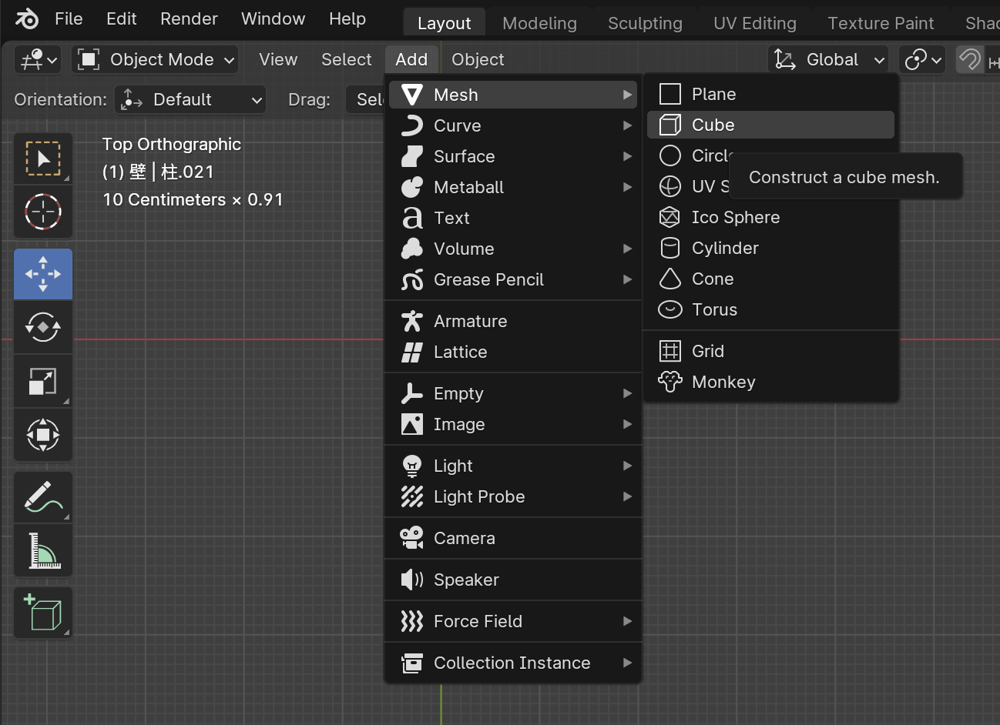
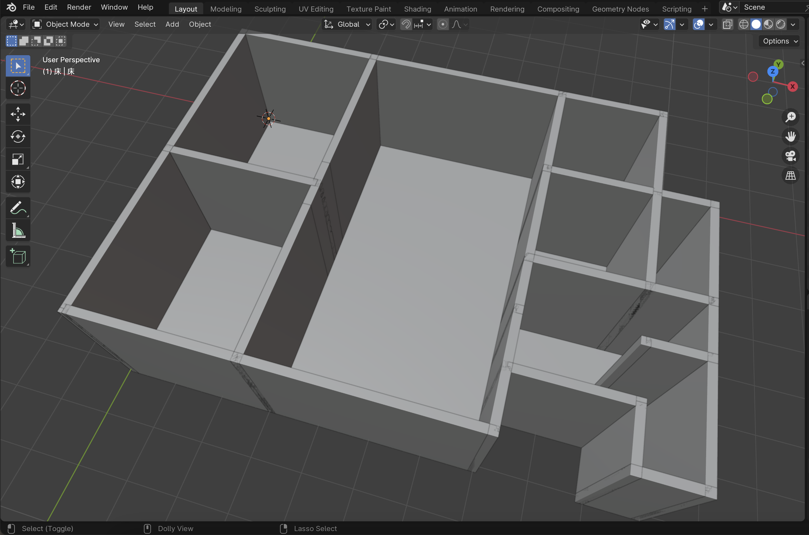

# 床を作る

## 床 Object を作る

### 床 Collection を作る

1. Outliner の空いてるところで右クリック
    - [New Collection] をクリック
2. 追加された Collection 名の部分をダブルクリック
    - 「床」にリネーム
3. 床以外の Collection を非表示にしておく
4. 床 Collection を選択している状態で
    - [Add] - [Mesh] - [Cube] をクリック

5. Cube の Object 名と Mesh 名を「床」にする

### Cube を床の形にする

1. Additional Quick Settings の View を開く（ショートカットは n）
2. 床 Object を選択する
3. Dimension の X を 0.91 m にする
4. Dimension の Y を 0.91 m にする
5. Dimension の Z を 0.2 m にする
6. Location の X を 0.455 m にする
7. Location の Y を -0.455 m にする
8. Location の Z を -0.1 m にする

9. [Object] - [Apply] - [All Transforms] をクリックして、変更した Transform をメッシュに適用する

## 床 Object を配置する

### 床を貼る

- ピンク : 床
- 青 : 土間

1. gizmo の z をクリックして上からみた表示にする
2. 他の Collection を表示する
3. 床 Object を選択する
4. Alt (option) + d でメッシュがリンクした複製を作る
    - Scale の X, Y を床のブロック数にする
    - Ctrl を押しながら移動してグリッドに合わせて配置する

全ての床を配置します。

## 土間 Object を作る

- a で全 Object を選択
- h で非表示にする
- 床 Collection を選択して
  - [Add] - [Mesh] - [Cube]
  - Object 名と Mesh 名を「土間床」にする

1. Additional Quick Settings の View を開く（ショートカットは n）
2. 土間床 Object を選択する
3. Dimension の X を 0.91 m にする
4. Dimension の Y を 0.91 m にする
5. Dimension の Z を 0.06 m にする
6. Location の X を 0.455 m にする
7. Location の Y を -0.455 m にする
8. Location の Z を -0.17 m にする

9. [Object] - [Apply] - [All Transforms] をクリックして、変更した Transform をメッシュに適用する

- 土間 Object を「床を貼る場所」の青色部分に配置する

