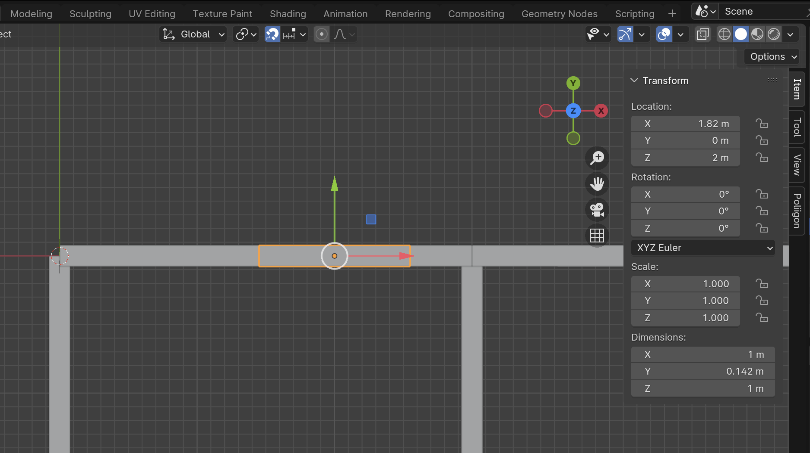

# 窓を作る

1. 「窓」Collection を追加する 
2. 他の Collection を非表示にする

3. [Add] - [Mesh] - [Cube]
4. n 
5. Dimension の X を 1 m にする 
6. Dimension の Y を 0.142 m にする 
7. Dimension の Z を 1 m にする 
8. Location の X を 0 m にする 
9. Location の Y を 0 m にする 
10. Location の Z を -0.5 m にする

11. [Object] - [Apply] - [All Transforms] をクリックして、変更した Transform をメッシュに適用する

12. 窓 Object を窓の位置に移動し、Location の Z を 2 m にする

13. 窓をつける壁 Object を選択し、Properties の Modifiers を選択する

14. Add Modifiers をクリックし、[Generate] - [Boolean] を選択する

15. Boolean Modifier の Object のところにあるスポイトツールをクリックし、窓 Object を選択する

16. 窓 Object を「部屋1_窓」にリネームする
17. 部屋1_窓 Object を選択したあと、Shift を押しながら窓のある壁 Object を選択する

18. Ctrl (Command) + p
19. Object を選択

（壁 Object の移動に窓が追随することを確認）

20. 部屋1_窓 Object を非表示にする

21. 部屋2 に窓をつける
22. リビングに掃き出し窓をつける（高さ 2.01 m、幅自由）
23. キッチンに横長の窓をつける（高さ 30 cm、幅自由）
24. 廊下の突き当たりに窓をつける（50 cm x 50 cm）
25. トイレに窓をつける（50 cm x 50 cm）

