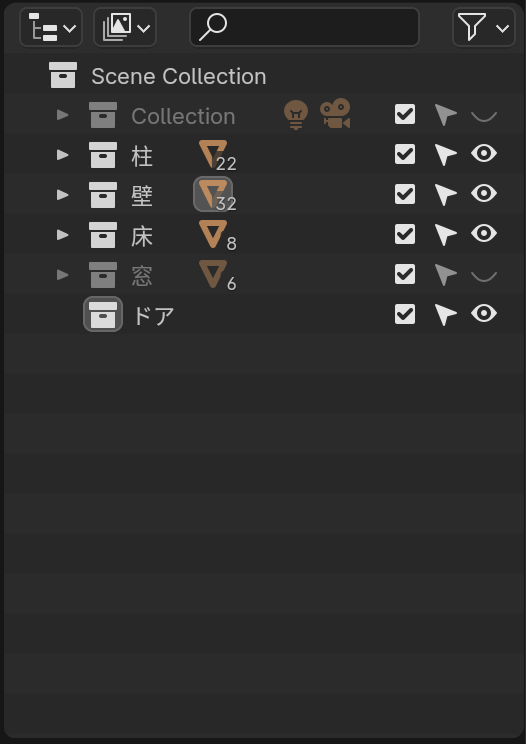
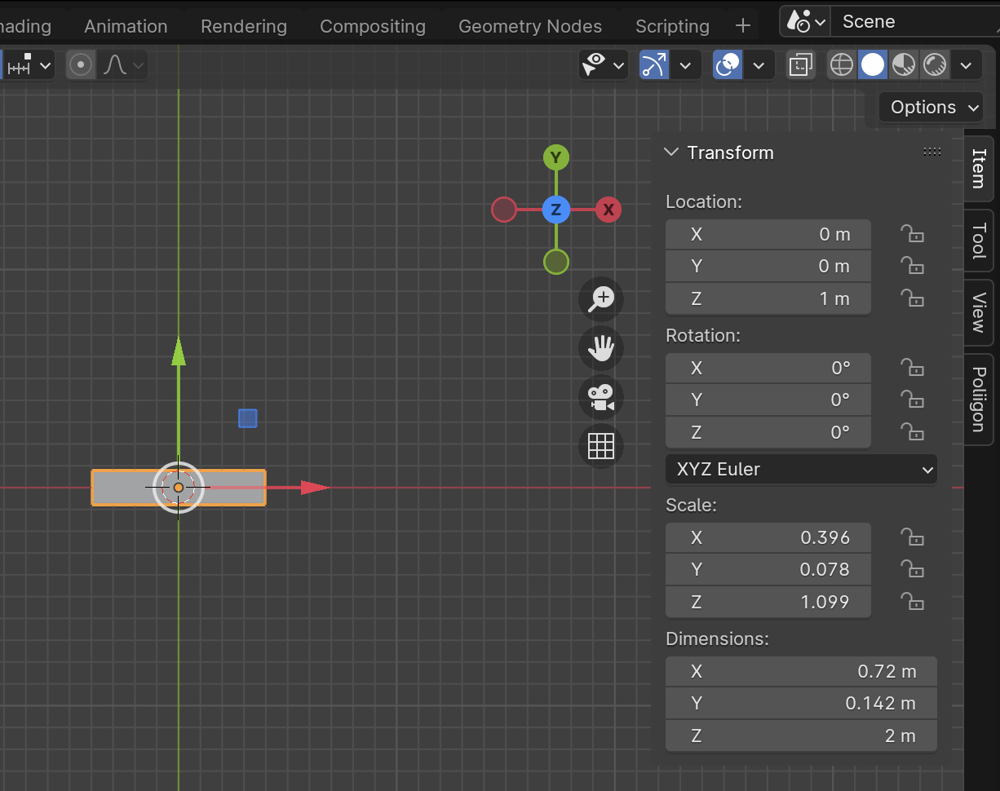
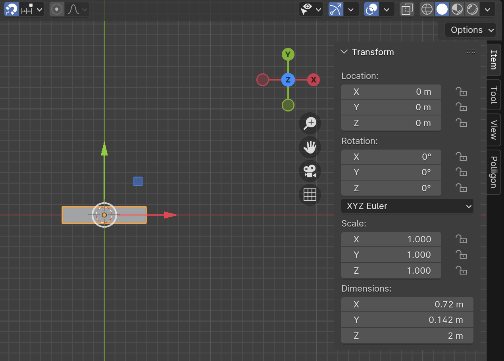
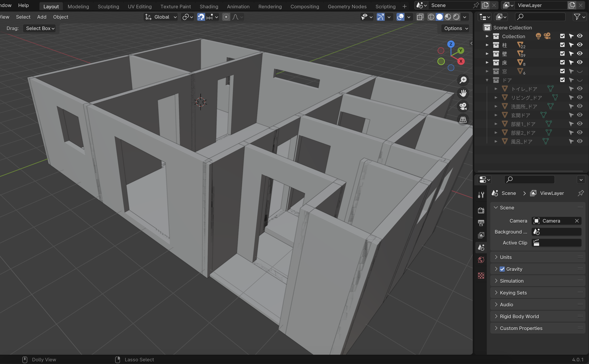

# ドアを作る

窓と同じ

1. 「ドア」Collection を追加する
2. 他の Collection を非表示にする

## 部屋のドア

- 部屋のドアの開口部
  - Dimension X: 0.72 m
  - Dimension Y: 0.142 m
  - Dimension Z: 2 m (Location Z : 1 m)

1. [Add] - [Mesh] - [Cube]
2. n 
3. Dimension の X を 0.72 m にする 
4. Dimension の Y を 0.142 m にする 
5. Dimension の Z を 2 m にする 
6. Location の X を 0 m にする 
7. Location の Y を 0 m にする 
8. Location の Z を 1 m にする

9. [Object] - [Apply] - [All Transforms] をクリックして、変更した Transform をメッシュに適用する

10. ドア Object をドアの位置に移動し、Location の Z を -0.01 m、Dimensions の Z を 2.01 m にする
11. ドアをつける壁 Object を選択し、Properties の Modifiers を選択する
12. Add Modifiers をクリックし、[Generate] - [Boolean] を選択する
13. Boolean Modifier の Object のところにあるスポイトツールをクリックし、ドア Object を選択する
14. ドア Object を「部屋1_ドア」にリネームする 
15. 部屋1_ドア Object を選択したあと、Shift を押しながらドアのある壁 Object を選択する 
16. Ctrl (Command) + p 
17. Object を選択

18. 部屋2_ドアを作る
19. リビング_ドアを作る
20. 洗面所_ドアを作る
21. 風呂_ドアを作る
22. トイレ_ドアを作る

## 玄関のドア

- 玄関のドアの開口部
    - Dimension X: 0.86 m
    - Dimension Y: 0.142 m
    - Dimension Z: 2.14 m (Location Z : 0.93 m)

1. 玄関のドアを作る

