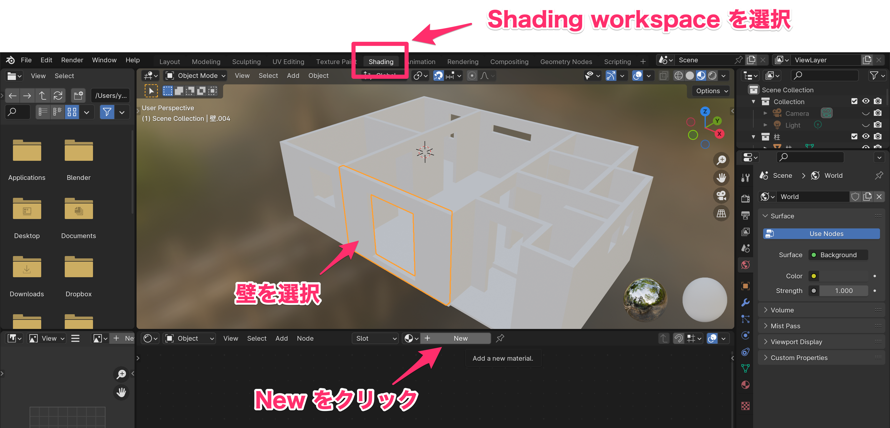
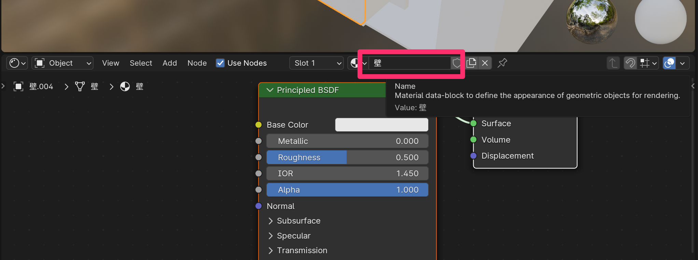
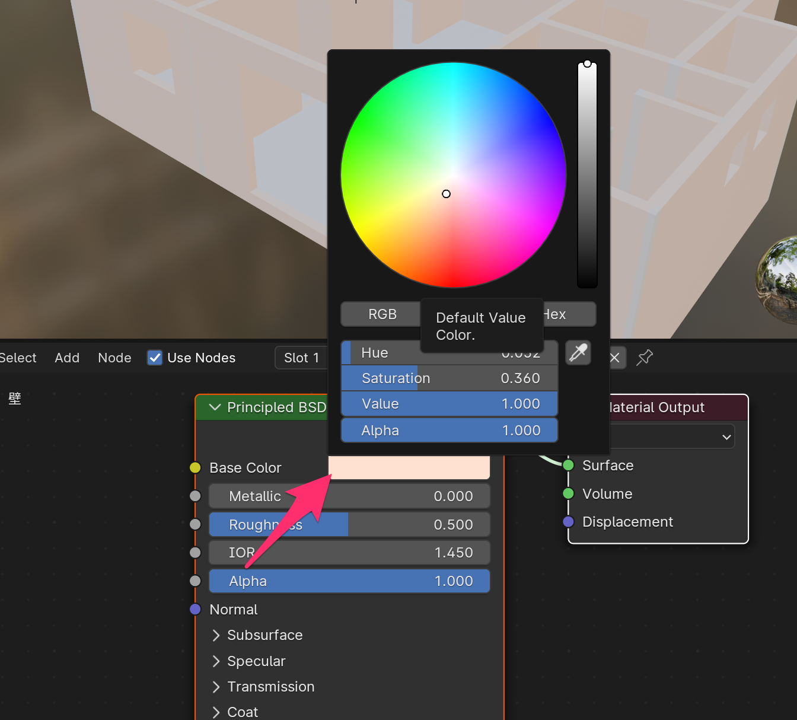
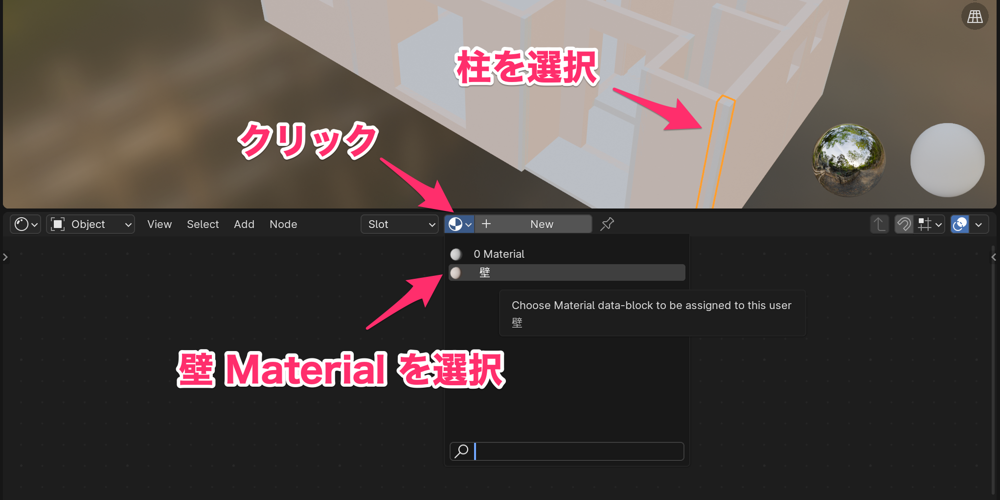
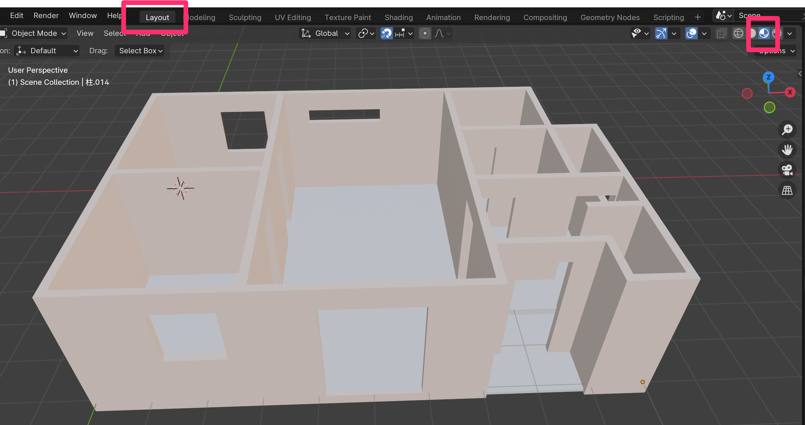

# 壁に色をつける

1. Shading workspace を選択
2. 壁 Object を選択
3. New をクリックして Material を追加する

4. 追加された Material の名前を「壁」に変更

5. Principled BSDF の Base Color をクリックして、好きな色に変える

（＊ BSDF は Bidirectional Scattering Distribution Function 双方向散乱分布関数です）

6. 柱 Object を選択
7. Material 一覧ボタンをクリックし、先ほど追加した壁 Material を選択

8. Layout workspace に戻る
9. Viewport Shading を Material Preview に変更する

