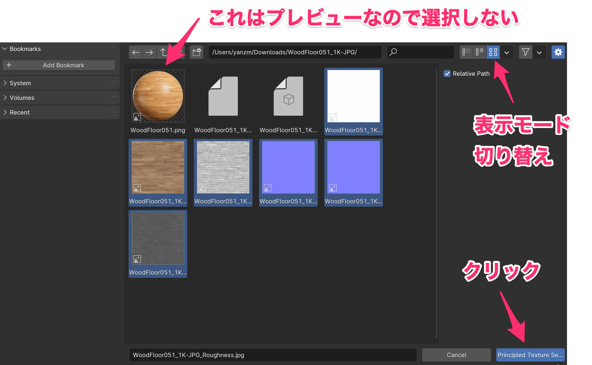

# 床をフローリングにする

## テクスチャを用意する

テクスチャを配布しているサイトがいろいろあります。  
ライセンスをチェックしましょう。

例えば https://ambientcg.com/ の[ライセンス](https://docs.ambientcg.com/license/)は  
Creative Commons CC0 1.0 Universal License（商用利用可能、クレジット表記不要）  
です。

では、

https://ambientcg.com/list?category=WoodFloor

から好きなフローリングを選んで、1K-JPG をダウンロードします。

## Node Wrangler Addon を入れる

1. [Edit] - [Preferences]

で Blender の設定を開く

2. 左側の Add-ons をクリックする
3. 上部の Community をチェックする
4. 検索窓に「node」と入力する
5. Node: Node Wrangler のチェックを ON にする
6. 設定を閉じる

## 床に Texture をセットする

1. Shading workspace に移動
2. 床 Object を選択
3. New をクリックして Material を追加

4. Material の名前を「フローリング」に変更

5. Principled BSDF を選択
6. Ctrl + Shift + t
7. ウィンドウが表示されるので、ダウンロードした zip を解凍したディレクトリを開く
8. プレビュー以外の画像（拡張子が .jpg のやつ）を全て選択する
9. Principled Texture Setup ボタンをクリックする

Node がセットアップされる

### Texture Coordinate 用の Object を用意する

部屋によってフローリングの目地の大きさがバラバラなのを直します。

1. Layout workspace に移動する
2. 新しく Collection を作り、名前を「Texture Coordinate」にする

3. Texture Coordinate Collection を選択
4. [Add] - [Mesh] - [Plane]

5. 適当な場所に Plane を移動
6. Plane の名前を「Texture Coordinate 用」にする

### Texture Coordinate 用の Object を Node にセットする

1. Shading Workspace に移動する
2. フローリング Material がセットされている 床 Object （どれか）をクリックする
3. Texture Coordinate Node の Object をドラッグして、Mapping Node の Vector に繋げる
4. Texture Coordinate Node の Object: に先ほど追加した Plane を指定する
5. Mapping Node の Scale: の X, Y で大きさを調整する

# お風呂の床を直す

お風呂の床までフローリングになってしまったので、風呂用の Material を用意して変更します。

