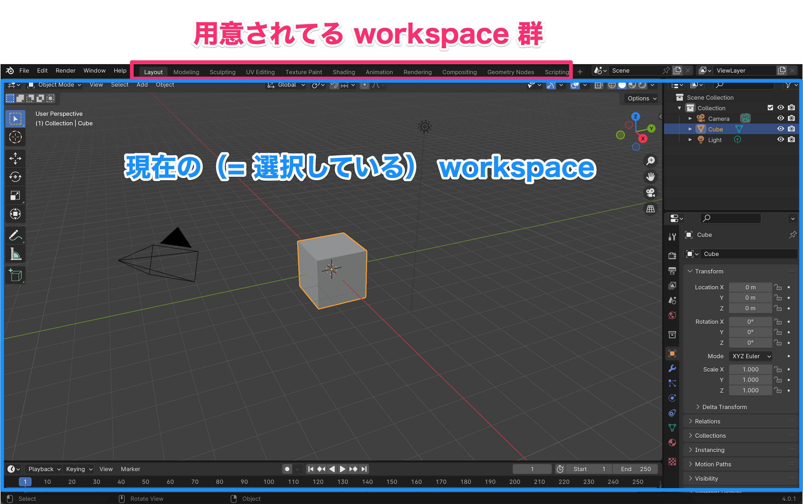
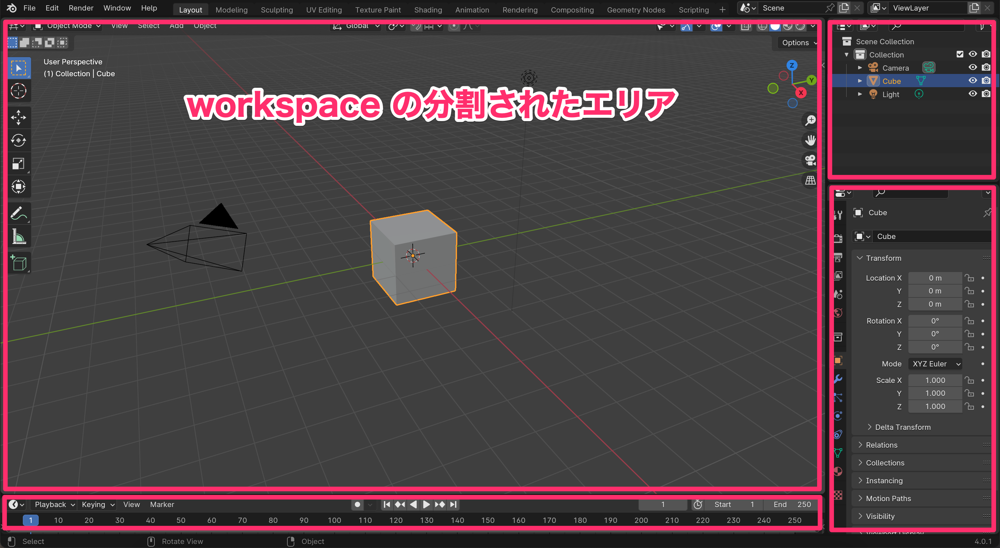
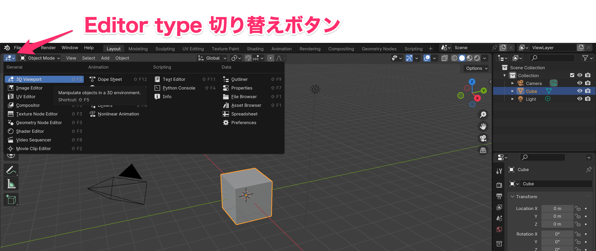
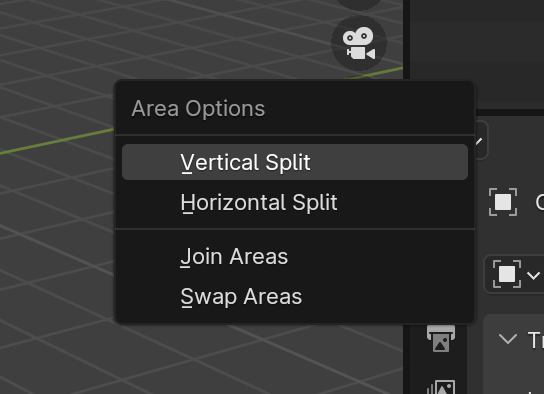
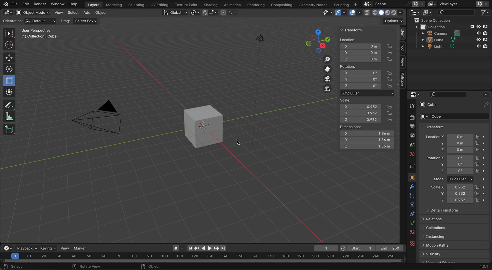
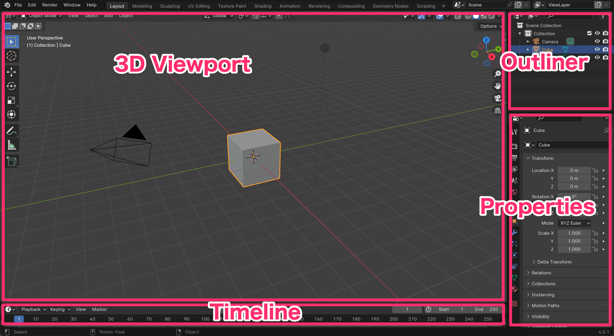

# Workspace

上部の [Layout] 〜 [Scripting] は Blender であらかじめ用意されている Workspace 群です。

Workspace とは、何の Editor を表示するかのプリセットです。 

また、Workspace は複数のエリアに分割することができます。

エリアごとに Editor type を指定でき、切り替えるにはエリアの左上のボタンをクリックします。

エリアの境界をドラッグしてエリアの大きさを変えることができます。

エリアの境界で右クリックするとオプションが表示されます。

さらに分割するときは、"Vertical Split" / "Horizontal Split" を選択し、
エリアを統合するときは "Json Areas"、エリアを入れ替える時は "Swap Areas" を
選択します。

### 全画面表示

分割された特定のエリアだけ表示させることができます。

- 全画面表示したいエリアにカーソルを移動する
  - Ctrl + space

解除するには以下のいずれかの操作をします

- Ctrl + space
- 上部バーの [Back to Previous] をクリック

## Layout workspace

Layout workspace はデフォルトで4のエリアに分割されています。

- 3D Viewport
- Timeline
- Outliner
- Properties

